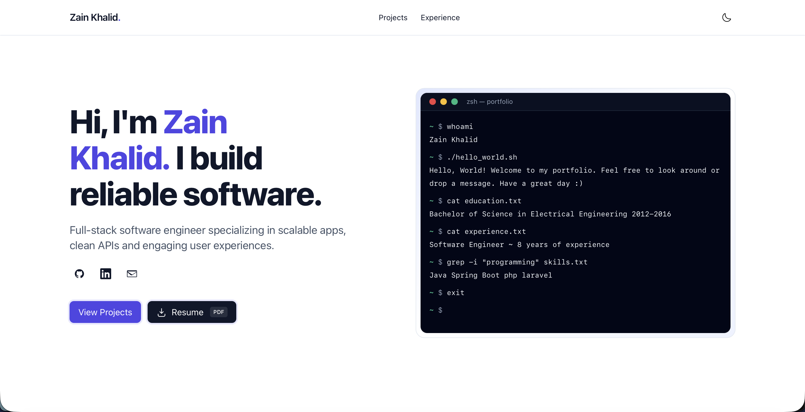
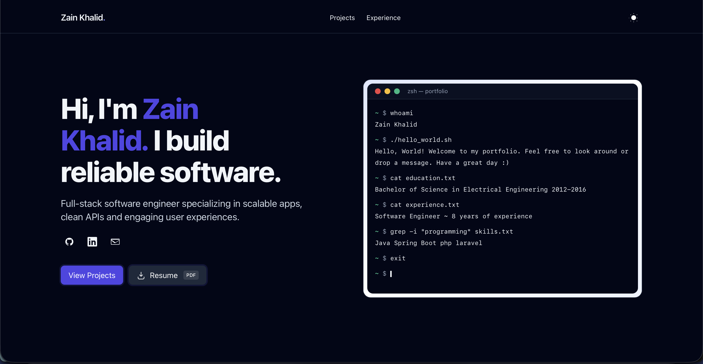
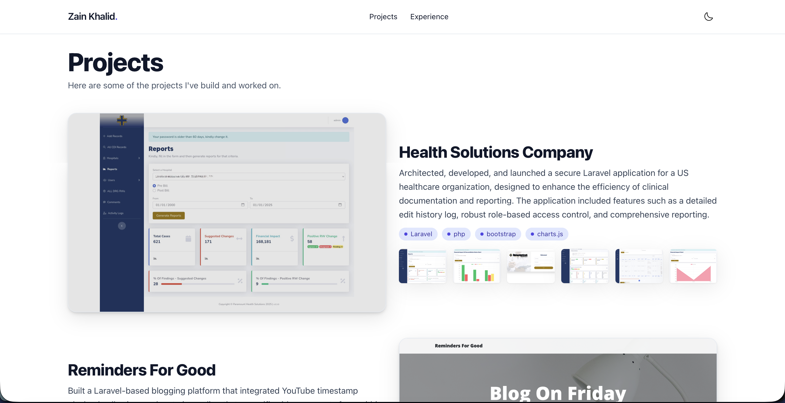
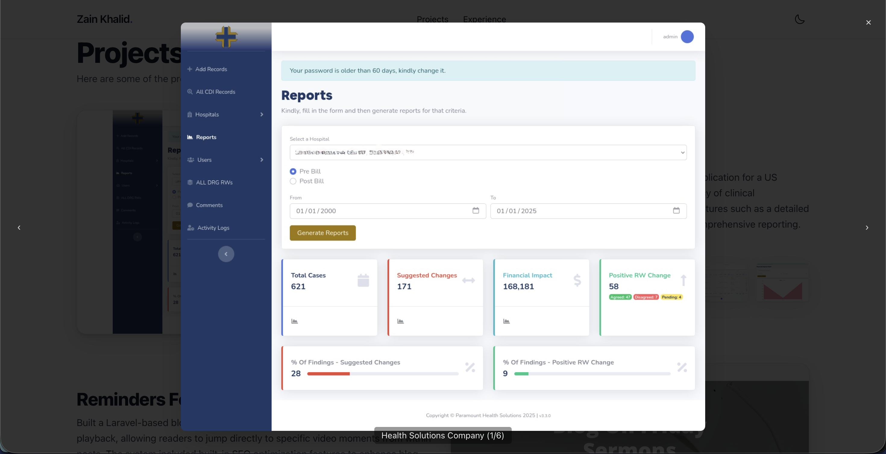
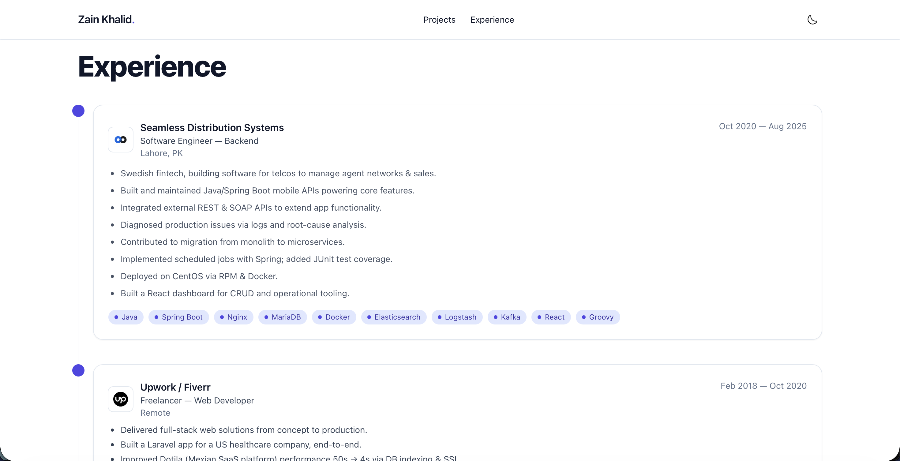
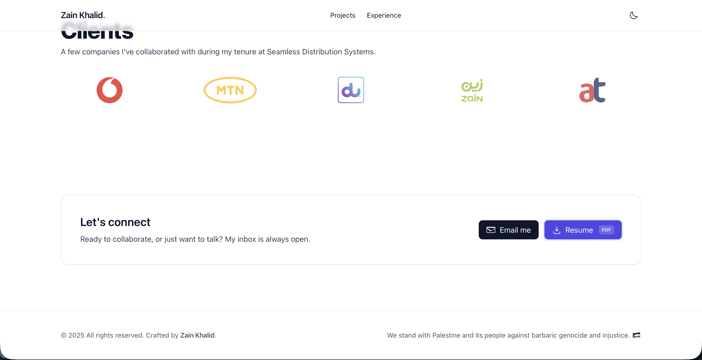

# Portfolio (tailwind, static)

Best for portfolios with lots of images. 
Minimal, zero‑build portfolio powered by Tailwind via CDN. Responsive layout, dark mode, enlarge the project image, clients logos, and a downloadable resume. While using a built template can restrict customizations to unique needs, this portfolio uses Tailwind so you can customize it to fulfill your needs.


Live demo: [zainkhalid.org](https://zainkhalid.org)

## Screenshots

<p align="center">
  
  <br/>
  <em>Main</em>
</p>

<p align="center">
  
  <br/>
  <em>Main (Dark)</em>
</p>

<p align="center">
  
  <br/>
  <em>Projects</em>
</p>

<p align="center">
  
  <br/>
  <em>Project Lightbox</em>
</p>

<p align="center">
  
  <br/>
  <em>Experience</em>
</p>

<p align="center">
  
  <br/>
  <em>Ending CTA</em>
</p>

## Quick start

- Open `index.html` directly in a browser, OR run:

```bash
python3 -m http.server 5173
```

Then visit `http://localhost:5173`.

## Customize

- Update name, bio, email, and socials in `index.html`.
- Replace resume at `assets/zainkhalid08-resume.pdf`.
- Edit projects in `assets/app.js` (`renderProjectsAlternating()` → `projects` array). First image is the main; rest are thumbnails.
- Place project images under `assets/images/p1..p5/`. Client logos live in `assets/logos/`.

## Structure

```
assets/
  app.js
  images/
  logos/
index.html
README.md
```

## License

MIT